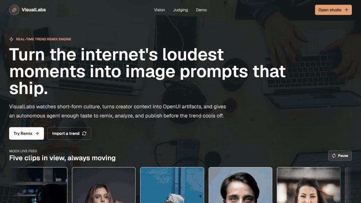

# VisualLabs - Sponsor-Powered AI Ad Production Line

## Demo walkthrough



Current GIF coverage: home page -> Import -> source link prep -> Remix workspace -> Analytics -> ClickHouse/Fastino training export.

Full runtime flow: home page -> Import -> `/api/ingest` Apify transcript/reference analysis -> `/remix/{id}` -> agent prompt refinement -> `render_image` / `submit_video` / `poll_video` tools -> `prepare_publish_dry_run` -> live analytics -> `export_training_dataset` -> ClickHouse/Fastino training records.

Generated with [HomenShum/feature-walkthrough-gif](https://github.com/HomenShum/feature-walkthrough-gif).

## Devpost walkthrough

**VisualLabs** is a sponsor-powered AI ad production line. It turns a topic, transcript, or social video idea into a complete short-form ad workflow: structured ad draft, improved image prompts, live image rendering, async video rendering, analytics, cost tracking, Composio publishing handoff, and a ClickHouse-to-Fastino/Pioneer training export loop.

**Try it out:** [aws-hackathon-ulrh.onrender.com](https://aws-hackathon-ulrh.onrender.com/)

Core idea:

> Creators should not have to jump between trend research, prompting, image generation, video rendering, analytics, and publishing tools. VisualLabs turns that whole workflow into one observable production line.

Instead of building just another image/video generator, we focused on the production harness around creative generation: the model drafts the ad, the UI turns it into an editable remix workspace, renders flow through governed infrastructure, costs are logged, analytics come back into chat, and high-quality prompts can be exported for a future small prompt model.

### Inspiration

Making a video ad still means juggling disconnected tools and never knowing what it actually cost until the invoice lands. A creator or marketer may use one tool for trends, another for prompts, another for images, another for video, another for analytics, and another for publishing. That means the feedback loop is slow, expensive, and hard to measure.

### What it does

VisualLabs starts with a creator prompt, imported Instagram Reels link, or transcript-style idea. The system then helps produce a short-form ad concept with a hook, CTA, pacing, and visual direction. From there, the creator can:

1. **Chat with the harnessed remix agent** - the right-side remix chat behaves like a creative director with safe production tools. It improves prompts, preserves character consistency, rewrites hooks, can call image/video render tools, prepares publish dry-runs, and exports training data.
2. **Inspect OpenUI artifacts** - generated prompts, analytics, and training-loop updates appear as compact chat artifacts that can expand into a review panel.
3. **Generate live stills** - the image button calls the render API from the current prompt and swaps the result into the image stage.
4. **Queue video rendering** - video is designed as an async submit-and-poll job so the demo does not block on long provider latency.
5. **Track costs and model comparisons** - generation events are logged so the product can compare base model vs. Pioneer/tuned-model economics.
6. **Publish through an action layer** - Composio is the social publish connector; the demo also supports a dry-run path so judges can see the workflow without firing a real post.
7. **Pull analytics back into chat** - Composio Instagram analytics can be summarized by the OpenAI agent and rendered through OpenUI.
8. **Export training data** - successful prompt/image pairs and chat history become JSONL records for the mocked Fastino/Pioneer small prompt-model pipeline.

### Why we built it

Short-form creative teams have the same repeated pain:

- Trend discovery happens in one place.
- Prompting happens somewhere else.
- Image generation and video rendering are slow and fragile.
- Analytics are disconnected from generation.
- Publishing is another manual step.
- No one can explain the cost per draft or whether a smaller specialized model could do the same work.

VisualLabs compresses that into one workflow:

```txt
Senso/context signal
  -> TrueFoundry gateway
  -> Fastino/Pioneer drafting model
  -> OpenUI remix workspace and artifacts
  -> image + video render pipeline
  -> ClickHouse cost and event warehouse
  -> Composio analytics/publishing handoff
  -> Render deployment
```

The goal was not only to create a good-looking demo, but to show a production-shaped AI system where every sponsor tool has a real role in the workflow.

### Sponsor stack

**Senso AI - context and trend intelligence**
Why: Visual output quality depends on memory: brand voice, creator style, product facts, approvals, and cited source context. Senso is the context layer we would use to hold that cited company/person/brand knowledge so the agent is not inventing context every time it writes an image or video prompt.

How it fits: Senso sits before prompt generation as the retrieval/context source for "what should this brand sound and look like?" In repo terms, it maps to the cited-context inputs that feed import, remix chat, prompt refinement, and the future training examples. We intentionally keep this out of a transactional app database; it is knowledge/context, not product auth or customer state.

How we used it for this demo: we seeded the `harness4visual` Senso org with a brand kit, four content types, a product line, competitor context, 40 GEO prompts, and sourced knowledge-base docs about the live VisualLabs/Harness Remix Studio workflow. Senso then generated draft explainers from that knowledge base and published three sample citeables to `cited.md`.

Why `cited.md`: the app should not rely only on private prompt context. Published citeables give search engines and AI systems stable, source-grounded URLs that explain what VisualLabs does, how it compares with adjacent tools, and what evidence supports the product story. That matters for GEO: if ChatGPT, Claude, Perplexity, or Gemini are asked about the product category, there are now public pages they can discover and cite instead of guessing from sparse app UI text.

Live citeables:

- [What public evidence shows how Harness Remix Studio works?](https://cited.md/article/what-public-evidence-shows-how-harness-remix-studio-works)
- [How does Harness Remix Studio compare with Canva AI Video Generator?](https://cited.md/article/how-does-harness-remix-studio-compare-with-canva-ai-video-generator)
- [What tools help keep a character consistent across AI-generated social assets?](https://cited.md/article/what-tools-help-keep-a-character-consistent-across-ai-generated)

Repo citation surface: [`cited.md`](cited.md) is the repo-level manifest, and [`app/cited.md/route.ts`](app/cited.md/route.ts) serves the same citation policy from the deployed app at `/cited.md`. The route source lives in [`lib/senso/cited-manifest.ts`](lib/senso/cited-manifest.ts).

Status: the external Senso knowledge system and `cited.md` publishing surface are live. The app runtime still uses imported source text and mock-safe context; the next engineering step is to wire the remix agent to retrieve from Senso directly before draft and prompt generation.

Future agent retrieval shape: add a read-only `retrieve_brand_context` tool to the harnessed agent. The tool would accept the imported source URL, product/persona, target platform, and draft intent, then query Senso for brand voice, visual tokens, creator constraints, approved claims, competitor context, and source citations. The agent would pass that normalized context packet into the TrueFoundry/OpenAI prompt before drafting or rendering, store the citations on the ClickHouse event row, and include those facts in the Fastino/Pioneer training records. If Senso is unavailable, the fallback is the existing `cited.md` manifest plus the imported transcript so the demo still runs.

**TrueFoundry - AI gateway and model routing**
Why: Model calls should not be scattered direct provider calls. TrueFoundry gives the system one governed gateway for model routing, env-based swaps, fallback behavior, and provider separation. This is what lets the same remix agent use OpenAI locally and route through the gateway in production.

How it fits: The remix agent and ingest analysis use an OpenAI-compatible path that can point at TrueFoundry. Pioneer is one of the models behind the gateway, not a replacement for it. Evidence: `lib/gateway/client.ts`, `lib/gateway/models.ts`, `lib/openai/remix-agent.ts`, and `lib/ingest/instagram.ts`.

**Fastino / Pioneer - specialized drafting model**
Why: A smaller specialized model is useful only if it preserves brand context and outputs better prompts at lower cost or latency. For VisualLabs, the target is a small language model that learns which image/video prompt patterns work for a specific person, company, or creator brand.

How it fits: Pioneer drafts structured ad concepts and is the target for the ClickHouse-to-Fastino training/export story. Good remix prompts, generated-image URLs, OpenUI artifacts, analytics summaries, and quality labels become JSONL records that can train or evaluate a specialized prompt model. Evidence: `lib/draft/generator.ts`, `lib/analytics/fine-tuning.ts`, `app/api/analytics/export/route.ts`, and `app/api/analytics/train/route.ts`.

Status: drafting path and export pipeline are wired; actual Fastino/Pioneer training is intentionally mocked unless a real training job is connected.

Future fine-tuning plan: keep ClickHouse as the append-only source of prompts, render URLs, analytics summaries, quality labels, and publish outcomes. Export JSONL through `/api/analytics/export`, split it into train/eval sets, score candidate records for visual specificity and brand consistency, then run a small Fastino/Pioneer prompt-model fine-tune. Promotion should be eval-gated: compare cost, latency, schema validity, prompt specificity, and downstream render quality against the base model before registering the tuned model behind the TrueFoundry gateway. The app should keep the current mock training job until that eval loop exists.

**OpenUI - default UI, artifacts, analytics, and generated UI**
Why: The app needs to show more than plain chat text. OpenUI lets the agent return structured, inspectable UI: prompt artifacts, analytics cards, training-pipeline status, and generated panels. This is especially important for judges because sponsor outputs become visible product surfaces, not hidden logs.

How it fits: OpenUI renders the remix prompt artifact, the dynamically generated Instagram analytics UI, and the ClickHouse/Fastino training artifact. The analytics UI comes from a live/mocked Instagram response pulled through Composio MCP, summarized by the OpenAI Agents SDK, and routed through the TrueFoundry/OpenAI agent path. Evidence: `components/openui/VisualRemixStudio.tsx`, `components/openui/OpenUIAgentFullscreen.tsx`, `components/openui/visual-openui-library.tsx`, `lib/openui/programs.ts`, and `app/api/openui/generate/route.ts`.

**ClickHouse - cost and event warehouse**
Why: We need an append-only record of what happened: prompt in, model out, render cost, latency, publish handoff, analytics result, and quality label. That record powers cost-per-draft, auditability, and the training dataset for the future small prompt model.

How it fits: ClickHouse is deliberately not a transactional app database. It is the event warehouse for prompt history, render telemetry, cost comparisons, and Fastino/Pioneer JSONL export. This is what lets VisualLabs preserve personal/company brand context over time without adding product auth or a primary app DB. Evidence: `lib/metrics/clickhouse.ts`, `lib/metrics/schema.sql`, `lib/analytics/chat-history.ts`, `lib/analytics/fine-tuning.ts`, and `app/api/analytics/history/route.ts`.

Status: ClickHouse writes are non-blocking. If keys are missing, the app uses memory/console fallback so the demo still works.

**Composio - publish and analytics action layer**
Why: The production line should end in a real action, not a downloaded asset. Composio gives the agent a governed way to call external tools for social publishing and analytics while keeping user approval explicit.

How it fits: The Instagram analytics route calls Composio tools, the OpenAI agent summarizes the response, and OpenUI renders the analytics artifact back in chat. The publish route can create a dry-run post for demo safety or call Composio when credentials/accounts are configured. Evidence: `lib/composio/instagram-analytics.ts`, `lib/composio/publish.ts`, `lib/openai/instagram-analytics-agent.ts`, `app/api/agent/instagram-analytics/route.ts`, and `app/api/publish/route.ts`.

**Render - deployment**
Why: Judges need a public URL, and background agent jobs should not rely on a browser tab staying open. Render gives us the deployment surface today and is the natural place to run durable workflow jobs for longer agent tasks.

How it fits: Render hosts the Next.js app through `render.yaml`. The render API is designed around submit/poll semantics so long-running video work can survive normal request boundaries. The next step is moving background dev-loop jobs, training exports, and grading/report generation into Render Workflow-style durable runs. Evidence: `render.yaml`, `app/api/render/route.ts`, and `lib/render/render-core.ts`.

Status: deployment is live; durable Render Workflow agent jobs are documented as the next production hardening step, not overclaimed as fully built.

Future MCP-on-Render shape: expose the harnessed agent as a Render-hosted action service with MCP-compatible tools for import, Senso retrieval, remix, image render, video submit/poll, publish dry-run, analytics pull, ClickHouse aggregation, and training export. Render would hold the production env, Composio credentials, Fal/Cloudinary keys, and ClickHouse access, while long-running video and training jobs remain submit/poll or durable workflow tasks instead of blocking a browser tab.

**OpenAI Agents SDK - agent orchestration**
Why: The app needs an agent that can reason over a prompt, call tools, summarize analytics, and decide what UI artifact should be shown. The OpenAI Agents SDK gives us that orchestration layer while TrueFoundry remains the gateway story for governed model access.

How it fits: The Instagram analytics agent uses a tool to fetch Composio Instagram data, then returns a summary and OpenUI artifact program. The remix agent is now the harnessed agent: it refines image/video prompts and can call safe tools for image render, async video submit/poll, publish dry-run preparation, and training dataset export. Live publishing remains an explicit approval path outside the chat tool. Evidence: `lib/openai/instagram-analytics-agent.ts`, `lib/openai/training-pipeline-agent.ts`, `lib/openai/remix-agent.ts`, `lib/openai/harnessed-agent-tools.ts`, and `app/api/agent/*`.

### How we built it

We built the app as a Next.js 16 vertical slice with API routes for the important production steps. The build intentionally avoids product auth, a transactional app database, billing, and admin screens because those do not help the three-minute hackathon demo.

The core surfaces are:

- `components/landing/HackathonLandingPage.tsx` - product landing page and sponsor/judging story.
- `components/openui/VisualRemixStudio.tsx` - creator-facing remix workspace, import, library, analytics, chat, render, publish, and export flow.
- `components/openui/OpenUIAgentFullscreen.tsx` - `/agent`, kept as the OpenUI streaming and agent-response test surface.
- `components/openui/visual-openui-library.tsx` - OpenUI artifacts for remix prompts, Instagram analytics, and the ClickHouse/Fastino training loop.
- `app/api/draft`, `app/api/render`, `app/api/publish`, `app/api/agent/*`, and `app/api/analytics/*` - API routes for drafting, rendering, publishing, analytics, and training export.

Core technical flow:

```txt
User enters a topic or imported source link
  -> /api/ingest or /api/draft
  -> Apify source import when an Instagram Reel is provided
  -> TrueFoundry gateway / OpenAI-compatible model path
  -> base model or Fastino/Pioneer model
  -> schema-valid draft or refined render prompt
  -> OpenUI remix workspace renders the result
  -> /api/agent/chat with harnessed agent tools
  -> render_image or /api/render kind="image"
  -> Fal Seedream or mock image path
  -> submit_video + poll_video or /api/render kind="video"
  -> Fal async job or mock video path
  -> prepare_publish_dry_run or /api/publish
  -> Composio publish or dry-run fallback
  -> export_training_dataset or /api/analytics/export
  -> ClickHouse events and Fastino/Pioneer JSONL records
```

The repo is intentionally mock-first. The app can run with zero keys and progressively light up real services lane by lane. `/api/draft` serves a mock draft, `/api/render` serves placeholder stills and a stand-in clip, `/api/publish` can dry-run, and telemetry degrades safely when ClickHouse is not configured.

### Future autonomous loop

The current build has the main hooks, but the fully autonomous version should run as one governed loop:

```txt
Instagram Reel or source URL
  -> /api/ingest with Apify caption/metadata scrape
  -> Senso retrieve_brand_context for brand voice, claims, visual tokens, and citations
  -> TrueFoundry/OpenAI Agents SDK analyzes the source and creates a remix plan
  -> OpenUI shows editable prompt/storyboard artifacts
  -> render_image creates the first still through Fal Seedream + Cloudinary
  -> submit_video queues Seedance and poll_video returns the permanent video URL
  -> prepare_publish_dry_run builds the caption and approval payload
  -> optional approved /api/publish sends through Composio
  -> Composio analytics returns profile/media performance
  -> ClickHouse stores source, prompts, renders, publish events, costs, and outcomes
  -> export_training_dataset builds Fastino/Pioneer JSONL
  -> eval-gated fine-tune promotes a smaller brand-preserving prompt model
  -> the agent recommends the next remix from the improved context
```

The production version should keep explicit approval before live publish, but every other step can be automated by the Render-hosted MCP/action agent once the retrieval and durable-job pieces are connected.

### Challenges we ran into

**Keeping scope under control**
We cut auth, a transactional database, Stripe, admin pages, long video chaining, production rate limiting, and full social account management. The point of the demo is the production pipeline, not business scaffolding.

**Making every sponsor tool feel load-bearing**
It is easy to build a media generation demo and mention sponsor tools as checkboxes. We wanted the opposite: every sponsor appears as a necessary step in the production line.

**Keeping the demo reliable**
Image generation can be a live stage moment. Video generation can take too long or fail, so the route supports async polling and a mock fallback clip.

**Building mock-first**
The team worked against frozen contracts and mock outputs so frontend, rendering, model, metrics, and publishing could move in parallel.

### Accomplishments that we're proud of

We are proud that this is not just a static mock. Even with zero keys, the app still runs end-to-end with deterministic fallbacks. With keys configured, the same contracts light up real model calls, image rendering, video jobs, telemetry, analytics, and publish handoff.

We are also proud of the OpenUI integration. OpenUI is used for chat artifacts, analytics artifacts, generated panels, and the agent testing surface, not just a decorative widget.

Finally, the cost and training-loop instrumentation is part of the product. ClickHouse events and exported JSONL records answer the real buyer question: can a cheaper specialized model produce useful creative output with lower cost or better latency?

### What we learned

A good AI product demo needs two stories at once:

1. **The user story** - the creator gets a remix studio that feels familiar and productive.
2. **The system story** - judges see a governed pipeline where models, renderers, analytics, and actions are coordinated.

We also learned that async video needs choreography. Image generation can be the live moment; video should be queued early and revealed later.

### What's next for VisualLabs

- Add the Senso `retrieve_brand_context` tool and feed its cited context into draft, remix, and render prompts.
- Promote the harnessed agent as a Render-hosted MCP/action service that can run source import, reference analysis, remix, generation, publish preparation, analytics, ClickHouse aggregation, and training export end to end.
- Keep publishing high-quality citeables to `cited.md` so VisualLabs has public, source-grounded pages for GEO monitoring and AI citation.
- Add TikTok analytics ingestion into ClickHouse.
- Expand OpenUI artifacts into storyboard, analytics, and judge-readiness artifacts.
- Add a real approval gate before Composio publish.
- Promote the Fastino/Pioneer tuned model only after evals show lower cost, better latency, valid schema output, and stronger brand-preserving render prompts.
- Store successful generations as training/eval examples for continuous model improvement.

### Built with

- Senso AI - context and signal layer
- TrueFoundry - AI gateway and model routing
- Fastino / Pioneer - specialized drafting model
- OpenUI - remix UI, artifacts, analytics, and generated panels
- ClickHouse - generation/event/cost telemetry
- Composio - Instagram analytics and social publishing action layer
- Render - deployment
- Next.js 16
- React 19
- Tailwind v4
- OpenAI Agents SDK
- Fal
- Cloudinary

### Three-minute demo script

1. Open VisualLabs and show the landing page product vision.
2. Enter the Studio / Remix workspace.
3. Import or paste a short-form video/source idea.
4. Ask the remix agent to improve the prompt.
5. Open or point to the OpenUI prompt artifact.
6. Generate a still image live.
7. Start or reveal the async video render path.
8. Pull Instagram analytics through Composio and render the OpenUI analytics artifact.
9. Prepare a dry-run publish through Composio.
10. Show the ClickHouse/Fastino training export behavior and close on the sponsor pipeline: Senso -> TrueFoundry -> Fastino/Pioneer -> OpenUI -> ClickHouse -> Composio -> Render.

Submitted to [Harness Engineering Hack](https://harness-hack.devpost.com/).

Sponsor-powered ad production line: **topic/transcript → structured draft (Pioneer via TrueFoundry) → images/video (Fal) → published (Composio)** — instrumented for cost in **ClickHouse** the whole way.

**Required reading:** [CLAUDE.md](CLAUDE.md) (what we're building, cut order, demo choreography) · [CONTRIBUTION.md](CONTRIBUTION.md) (lanes, git flow, mock-first discipline).

## Quickstart

```bash
cp .env.example .env.local   # fill what your lane owns
npm install
npm run dev                  # http://localhost:3000
```

**The app runs with ZERO keys.** `/api/draft` serves the mock draft, `/api/render` serves placeholder stills and a stand-in clip, metrics log to console. Fill keys lane by lane and the real thing replaces the mock behind the same contract — the UI never changes.

`npm run build` must pass before you merge. `main` always builds.

## Lanes (see CONTRIBUTION.md for the full map)

| Owner | Branch | Lane |
| --- | --- | --- |
| **A — model & gateway** | `a-draft-gen` | `lib/gateway/`, `lib/draft/`, `app/api/draft/`, `lib/schema.ts` (**frozen at minute 20**) |
| **B — render & data** | `b-image-render` | `lib/render/` (lift from VisualLabs), `lib/metrics/`, `app/api/render/` |
| **C — frontend & demo** | `c-storyboard` | `app/page.tsx`, `components/`, deploy (`render.yaml`) |
| **D — integration & demo lead** | `d-composio` | `lib/composio/`, glue, fallback assets, demo script |

## The seam

- [`lib/schema.ts`](lib/schema.ts) — the frozen draft contract (zod + types). Everything imports this.
- [`lib/mock.ts`](lib/mock.ts) — the draft object everyone builds against until real upstreams land. Blocked on someone? You skipped the mock.
- API contracts are documented in [`app/api/draft/route.ts`](app/api/draft/route.ts) and [`app/api/render/route.ts`](app/api/render/route.ts) — keep the contracts, swap the internals.

## Deploy

Render blueprint in [`render.yaml`](render.yaml). C deploys **in the first hour**, empty shell or not, and every meaningful merge goes to the shared deploy. Judges hit a URL, not localhost.
